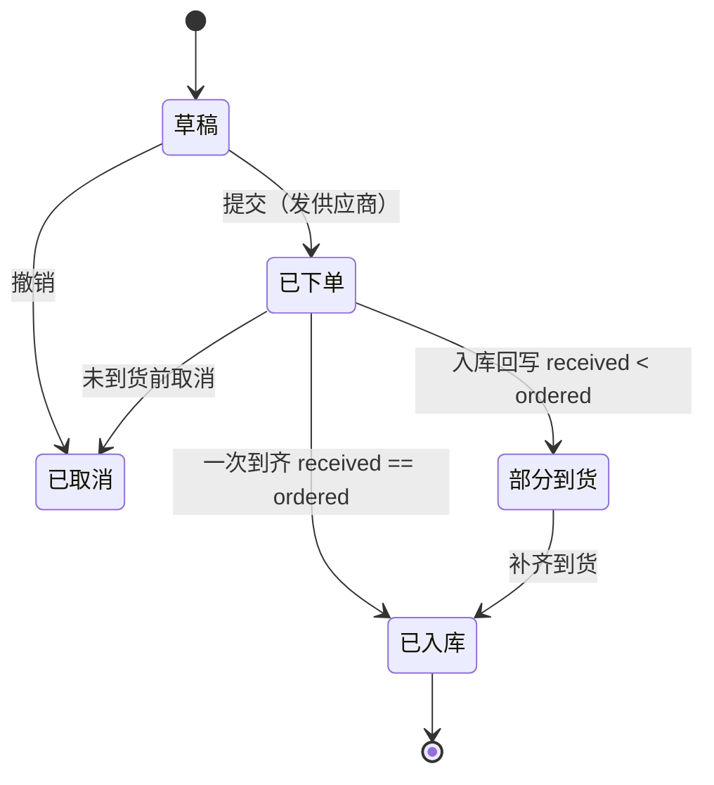

# 领域模型与核心不变量

> 规范事实源。库存系统的"宪法"：实体、字段、不变量、状态机、权限矩阵。所有页面与工具都围绕本文长。

## 第一性原理：库存是派生值

库存**不是一个可写字段**，而是不可变流水（`stock_ledger`）按 SKU 累加出来的派生值。这一条决定整套数据模型，也是与 Excel 的根本区别——Excel 记"状态"（当前库存、可被覆盖），本系统记"事件"（每一次变动、只增不改）。

## 实体

### SKU（三维：款号 × 颜色 × 尺码）

服装批发的 SKU 是三维的，一个款号炸出几十个 SKU；这是数据模型必须正面承载的特性，不能退化成单一商品。

```text
sku
  sku_code     PK，= "{style_no}-{color}-{size}"，如 AW2024-3301-藏青-M
  style_no     款号        style_name 品名        category 品类
  color        颜色        size       尺码（序：S/M/L/XL/2XL）
  cost_price   成本价（整数分，敏感：仓管不可见）
  tag_price    吊牌价（整数分）
  safety_stock 安全库存阈值
  barcode      条码
```

### stock_ledger（不可变流水：唯一真相源）

```text
stock_ledger          —— append-only，无 UPDATE / DELETE
  id           PK
  sku_code     FK
  delta        有符号整数（入库为正；出库 / 盘亏为负）
  biz_type     期初 / 采购到货 / 销售出库 / 调拨 / 盘盈 / 盘亏 / 红冲 …
  doc_no       关联单据号（入库单 / 出库单 / 采购单 / 盘点单）
  ts           业务时间
  operator_id  录入人        reviewer_id  复核人（null = 待复核）
  status       pending | posted        （仅 posted 计入库存）
  scanned      是否扫码录入（false = 手输，归因风险信号）
  qc           收货是否点数 / 质检（归因信号）
  po_ref       关联采购单（归因信号）
  reversed_by  红冲指向（纠错链）
```

> 库存查询：`stock(sku) = Σ delta WHERE sku_code = ? AND status = 'posted'`。

### purchase_order / po_line（采购单 + 明细）

```text
purchase_order: po_no PK, supplier, status, created_by, eta, created_at
po_line:        po_no FK, sku_code, ordered, received, price(整数分)
```

### stocktake / stocktake_count（盘点单 + 实盘）

```text
stocktake:       pd_no PK, scope, status(待复核|已过账), snap_ts(账面快照时点),
                 counter(盘点人), created_by, counted_at
stocktake_count: pd_no FK, sku_code, book_snapshot(账面快照), actual(实盘录入)
```

实盘不进 SKU 状态，只作为盘点单的一次性校准输入；详见 [stocktake-reconciliation.md](./stocktake-reconciliation.md)。

### app_user（角色）

```text
app_user: id, name, role(warehouse | buyer | admin)
```

## 核心不变量

```text
I1 守恒：    期末库存 = 期初 + Σ入库 − Σ出库
I2 单一真相：stock(sku) == Σ stock_ledger.delta(sku, status = posted)
```

由此推导三条架构红线（= 与 Excel 的全部差异）：

1. **库存不可直接编辑，只能追加流水。** 没有 `UPDATE stock.qty` 入口；+10 件就追加一条 `delta=+10`。I2 恒成立，账实不符只可能落在"流水如实反映现实"这条边界之外。
2. **流水不可删改，只能红冲。** 录错 `+100` 不能改成 `+10`、也不能删，而是追加 `biz_type=红冲, delta=−100` 再补 `+10`，`reversed_by` 串起纠错链；原始错误永久留痕，是事后复盘"三万差在哪"的物理基础。
3. **改变库存的动作需双人复核。** 出入库、红冲、盘点过账走 `待复核 → 已复核`，`reviewer_id ≠ creator_id` 后端强校验——对应"8 人并发、无复核、错了没人兜"的痛点。

## 采购单状态机



到货动作必须生成一条 `采购到货` 入库流水（经复核）并回写 `po_line.received`——绝不只改状态字段。

## 角色与权限矩阵

| 角色 | 库存 | 出入库 | 采购单 | 盘点对账 | 成本 / 金额 |
| --- | --- | --- | --- | --- | --- |
| 仓管 warehouse | 只读 | 录入（待复核） | — | — | 不可见（字段脱敏） |
| 采购 buyer | 只读 | — | 创建 / 下单 / 收货 | 查看 / 复核 | 可见 |
| 老板 admin | 只读 | 录入 / 复核 | 全部 | 查看 / 复核 / 过账 | 可见 |

权限在**数据层**生效：接口级 RBAC（越权 403）+ 序列化层字段脱敏（响应体根本不出现 `cost_price` 键），不是前端藏按钮。

## 金额

一律 **整数分（cents）** 存储与计算，仅展示层 `/100` 格式化；合计 = 逐单求和、二者逐分对齐，杜绝浮点累加误差。
